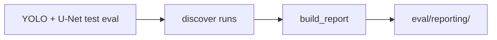

# Post-eval reporting runbook

CPU-only job that discovers finished **test** eval artifacts on scratch and writes the **reporting bundle** under `eval/reporting/`. Not part of inference or per-job metric computation.

**Headline vs supporting metrics:** policy and field definitions in [`docs/metrics.md`](../metrics.md#policy-headline-vs-supporting) and [`#pq-centered-rerun-policy`](../metrics.md#pq-centered-rerun-policy); glossary **Post-eval reporting** in [`CONTEXT.md`](../../CONTEXT.md).

| Role | Metrics | Source eval |
|------|---------|-------------|
| Headline tables and figures | **Whole-section PQ** plus [**PQ diagnostics**](../metrics.md#pq-diagnostics) | YOLO and U-Net whole-section test `instance_metrics.json` |
| Supporting patch diagnostics | Patch-level [**instance metric bundle**](../metrics.md#instance-metrics-all-producers) aggregates | `eval/yolo_patches/`, `eval/unet_patches/` |
| YOLO-only patch detector panel | AP/mAP from Ultralytics patch val | `eval/yolo_patches/` only—not cross-model evidence |

Do not use patch AP/mAP or patch means as **variant test ranking** or **model test comparison** (whole-section PQ under the shared **test inference recipe**). Use PQ-centered held-out eval only; stale scratch outputs: [`metrics.md` § Stale AJI-selected](../metrics.md#stale-aji-selected-scratch-outputs).

## Prerequisites

- YOLO and U-Net whole-section test eval jobs have written `instance_metrics.json` under `eval/`.
- Optional patch eval outputs for supporting panels.

## Pipeline overview



## Build report

Scripts under `SLURM/analysis/`. **`submit_*.sh` files are login-node launchers** — run them with `bash` from the repo root; they call `sbatch` on the `run_*.sh` job scripts internally. Do not `sbatch` a `submit_*.sh` script.

**Submit:** `bash SLURM/analysis/submit_build_report.sh`

**Run:** `sbatch SLURM/analysis/run_build_report.sh`

### Resources

| Setting | Value |
|---------|--------|
| Memory | 8G |
| CPUs | 4 |
| Time | 15m |
| GPU | none |

### Optional environment

| Variable | Effect |
|----------|--------|
| `GRAINSEG_ROOT` | Override scratch root (default `$SCRATCH/GrainSeg`) |
| `OUTPUT_DIR` | Override bundle path (default `$GRAINSEG_ROOT/eval/reporting`) |
| `REPORT_STRICT=1` | Pass `--strict` to the CLI |
| `REPORT_NO_FIGURES=1` | Pass `--no-figures` (tables + summary only) |

### Local (login node)

```bash
uv sync --group analysis
uv run --group analysis python -m analysis.build_report \
  --grainseg-root "$SCRATCH/GrainSeg"
```

### Examples

```bash
bash SLURM/analysis/submit_build_report.sh
# or
sbatch SLURM/analysis/run_build_report.sh
```

Logs: `logs/post_eval_report-<jobid>.log`.

## Outputs

Under `$SCRATCH/GrainSeg/eval/reporting/` (or `OUTPUT_DIR`):

| Path | Contents |
|------|----------|
| `derived/` | Comparison tables |
| `figures/` | Thesis charts (whole-section PQ headline heatmap and bars, PPL-relative PQ delta; supporting YOLO patch-val mAP panel) |
| `analysis_summary.json` | Run summary |

**Eval run discovery (v1):** `analysis.build_report` locates runs by path conventions per **producer**, registry variant key, and **sample unit** (whole vs patch). Implementation: `src/analysis/discover.py`. No catalog file in v1.

Variant axis labels use `display_name` in `config/variants.yaml` (thesis order: PPL → FullStack → PPL+XPLComp → FullComp).

## Upstream

| Inputs | From |
|--------|------|
| `eval/yolo_{variant}/`, `eval/yolo_patches/` | [yolo.md](yolo.md) |
| `eval/unet_test/`, `eval/unet_patches/` | [unet.md](unet.md) |
