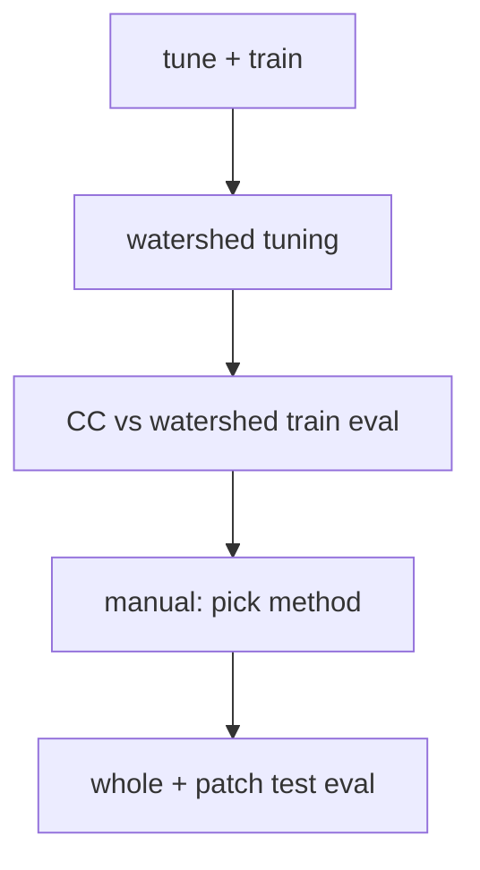

# U-Net runbook

Semantic segmentation + instance extraction (connected components or tuned watershed). Scratch layout: [`docs/reference/scratch-layout.md`](../reference/scratch-layout.md). Staging: [`docs/reference/staging.md`](../reference/staging.md). Manifests: [`docs/manifests.md`](../manifests.md).

## Prerequisites

- [Preprocessing](preprocessing.md) through rasterized labels and manifests:
  - `dataset/train/train_labels.tif`
  - `dataset/train/manifests/{variant}.whole.json`, `dataset/test/manifests/{variant}.whole.json`
  - `dataset/test/unet_from_yolo/{variant}/manifest.json` for patch test eval
- Pretrained start: `models/unet/pretrained/starting_point.keras` on scratch (or repo `models/pretrained/` fallback)

Jobs stage **manifest-listed files only** via `python -m common.stage_manifest run`.

## Pipeline overview



| Phase | Submit script | Run script |
|-------|---------------|------------|
| Tune + train | `submit_tune_and_train_variants.sh` | `run_tune_and_train_variant.sh` |
| Watershed predict | `submit_watershed_tuning.sh` | `run_watershed_tune_predict.sh` |
| Watershed tune (default) | `submit_watershed_tuning.sh` | `run_watershed_tune_shard.sh` (array) → `run_watershed_tune_merge.sh` |
| Watershed tune (monolithic) | `submit_watershed_tuning.sh --single-job` | `run_watershed_tuning.sh` |
| Train instance compare | `submit_cc_vs_watershed_train_eval.sh` | `run_whole_test_eval.sh` ×2 |
| Test whole | `submit_whole_test_eval.sh` | `run_whole_test_eval.sh` |
| Test patches | `submit_patch_test_eval.sh` | `run_patch_test_eval.sh` |

Scripts under `SLURM/unet/`. **`submit_*.sh` files are login-node launchers** — run them with `bash` from the repo root; they call `sbatch` on the `run_*.sh` job scripts internally. Do not `sbatch` a `submit_*.sh` script.

## Config files

| File | Role |
|------|------|
| `SLURM/unet/whole_eval_models.tsv` | Model basename + variant rows for whole eval |
| `config/variants.yaml` | Channel counts, default model basenames, watershed tune dir slugs |

## Tune and train variants

**Submit:** `bash SLURM/unet/submit_tune_and_train_variants.sh`

**Options:** `--ppl`, `--ppl-ppx-composite`, `--ppl-plus-ppx-composite`, `--all-ppx`, `--all`; `--resume`, `--skip-tuning`, `--verbose`

Bayesian search (optional) + final training per variant. Requires `train_labels.tif` and `dataset/train/manifests/{variant}.whole.json`.

| Output | Path |
|--------|------|
| Models | `models/unet/unet_finetuned_{variant}.keras` |
| Tuning logs | `tuning_logs/{run_name}/` |

```bash
bash SLURM/unet/submit_tune_and_train_variants.sh --all
```

## Watershed tuning

**Submit:** `bash SLURM/unet/submit_watershed_tuning.sh`

**Default:** predict-then-tune with parallel grid shards per **input configuration** (registry variant):

1. **Predict** — `run_watershed_tune_predict.sh` runs sliding-window U-Net inference once on the train whole section and writes durable semantic predictions to scratch.
2. **Shard tune** — a throttled SLURM job array (`run_watershed_tune_shard.sh`) scores one axis-aligned shard per task from cached preds via `--preds-dir` only. Shard count equals `len(min_distance) × len(boundary_dilate_iter)` in the grid YAML (six shards of twelve combos each on the default grid). Each shard job writes `watershed_grid_{run_tag}_shard_{index}.csv` and does not emit best JSON.
3. **Merge** — `run_watershed_tune_merge.sh` concatenates shard CSVs, selects the winner by train **mean_pq**, and writes the canonical `watershed_grid_{run_tag}.csv` plus `watershed_best_{merge_job_id}.json`. Downstream whole eval and CC-vs-watershed selection resolve the latest `watershed_best_*.json` by mtime as before.

`submit_watershed_tuning.sh` assigns a shared **run tag** per variant at submit time so shard outputs and merge inputs resolve predictably. The dependency chain is predict → shard array → merge (`--dependency=afterok`).

**Resubmit tune only:** after predict jobs have already written semantic preds to scratch, `submit_watershed_tuning.sh --use-cached-preds` submits the shard array and merge only (no predict, no model weights required).

**Monolithic opt-out:** `submit_watershed_tuning.sh --single-job` submits one `run_watershed_tuning.sh` job per variant that writes grid CSV and best JSON directly (no shard CSVs, no merge job). Use when simpler orchestration is preferred over parallel shard turnaround.

**Throttle:** set `WATERSHED_TUNE_SHARD_MAX_PARALLEL` (default `6`) to cap concurrent shard array tasks when submitting all registry variants.

**Grid config:** `config/watershed_tune_grid.yaml` — axes under `grid:` (`min_distance`, `boundary_dilate_iter`, `watershed_connectivity`, `min_area_px`, `exclude_border`, `ridge_level`). Loader: `unet.watershed_tune_grid.load_watershed_tune_grid`. Override at submit time via `--grid-config` or `GRID_CONFIG`; shard and merge runners receive the path through the exported `GRID_CONFIG` env var (monolithic `run_watershed_tuning.sh` also accepts `--grid-config`). Committed config omits pixel-scale `min_distance=1`.

Train-side watershed tuning still selects by **whole-section PQ** on the train **merged instance view** and persists **`MergedViewPqResult`** audit fields (`best_mean_pq` / `best_mean_*` / `best_per_sample_*` in `watershed_best_*.json`; `mean_*` / `{field}__{sample_id}` in the grid CSV). Selection uses **`pq` / `mean_pq` only**; other fields are diagnostics. Held-out **eval** still uses the full [**instance metric bundle**](../metrics.md#instance-metrics-all-producers) ([PQ policy](../metrics.md#pq-centered-rerun-policy)).

**Tune-path performance caches:** `tune_watershed` reuses work across grid combos via `unet.watershed_tune_extraction_cache`:

| Cache | Built | Reused across | Still per combo |
|-------|-------|---------------|-----------------|
| Semantic prep (masks, distance transform, auto ridge) | once per sample | all combos | — |
| Base watershed label maps | on first touch per unique `(min_distance, exclude_border, boundary_dilate_iter, watershed_connectivity, ridge_level)` | `min_area_px` variants sharing that base | scoring |
| GT overlap prep (`GtOverlapPrep`: ids + areas) | once per sample | all combos | pred overlap + pixel co-occurrence scan |

Default grid (`config/watershed_tune_grid.yaml`): **72** scored combinations, **24** full base extractions per sample. The GT overlap prep is a modest metrics-side win (avoids redundant GT `bincount` bookkeeping; pred-side overlap dominates metrics time on large sections) — see docstring on `build_gt_overlap_preps`.

**Verifying cache behavior in SLURM logs:** pass `--log-extraction-cache` to `unet.tune_watershed` (or set `LOG_EXTRACTION_CACHE=1` in `run_watershed_tuning.sh`) to emit optional per-combo lines: `extraction cache: miss (sample_id)` when a new base watershed label map is computed, or `extraction cache: hit (sample_id)` when reusing a cached base for a different `min_area_px`. On the default grid with one train sample, expect **24** miss lines and **48** hit lines across the full job (72 combos). Without the flag, only startup summary and per-combo phase timings are logged (`Extraction cache: up to 24 on-demand base maps per sample` is always printed).

**Grid CSV row order:** rows follow `itertools.product` over the YAML axis order (`min_distance`, `boundary_dilate_iter`, `watershed_connectivity`, `min_area_px`, `exclude_border`, `ridge_level`). Order is stable for diffing reruns when `config/watershed_tune_grid.yaml` is unchanged.

**Runtime (order of magnitude):** on the default grid with extraction caching, expect roughly **2–3 hours per shard** when the cluster runs shards concurrently (twelve combos per shard), versus **10–12 hours** for a monolithic `--single-job` run. Shard jobs request **3 hours** wall time (`run_watershed_tune_shard.sh`); monolithic tune requests **12 hours** (`run_watershed_tuning.sh`). Do **not** run the full grid on a **login node** — use `bash SLURM/unet/submit_watershed_tuning.sh` or `srun`/`sbatch` for smoke checks (`unet.watershed_tune_smoke`) only.

| Output | Path |
|--------|------|
| Cached preds | `runs/watershed_tune_preds/{slugs.job}/semantic/{sample_id}_pred.tif` |
| Shard grid CSV | `runs/watershed_tune/{slugs.job}/watershed_grid_{run_tag}_shard_{index}.csv` |
| Merged grid CSV | `runs/watershed_tune/{slugs.job}/watershed_grid_{run_tag}.csv` |
| Best params | `runs/watershed_tune/{slugs.job}/watershed_best_*.json` (latest mtime wins) |

`--dry-run` prints `sbatch` commands without submitting.

```bash
bash SLURM/unet/submit_watershed_tuning.sh
bash SLURM/unet/submit_watershed_tuning.sh --use-cached-preds
bash SLURM/unet/submit_watershed_tuning.sh --single-job
```

### Pre-SLURM smoke check

Before submitting the full watershed tune grid, exercise one parameter combo on synthetic large-shape masks (no cached preds, manifests, or GPKG reads):

```bash
uv run python -m unet.watershed_tune_smoke
```

Defaults: train-section aspect ratio at 1/10 scale (`1000×5200`), first combo from `config/watershed_tune_grid.yaml`, real watershed extraction plus `compute_merged_view_pq`. Logs include per-phase `watershed` and `metrics` timings like the tune job.

| Flag | Purpose |
|------|---------|
| `--full-shape` | Use train mosaic geometry `10000×52000` (slow; prefer `srun` on a compute node) |
| `--height` / `--width` | Override declared geometry |
| `--min-distance`, `--boundary-dilate-iter`, … | Override the single combo under test |

Focused tests: `uv run pytest src/unet/tests/test_watershed_tune_smoke.py -q`

## CC vs watershed (train section)

**Submit:** `bash SLURM/unet/submit_cc_vs_watershed_train_eval.sh`

Two jobs compare connected components vs tuned watershed on **train** using `whole_eval_models.tsv`, `--manifest-split train`, `train_labels.gpkg`. Both jobs receive `--watershed-tune-root` so they resolve the same per-variant `watershed_best_*.json` artifacts.

| Output | Path |
|--------|------|
| CC | `eval/instance_val_cc/` |
| Watershed | `eval/instance_val_watershed/` |
| Selection | `eval/extraction_method_selection.json` |

**CC `min_area_px` policy:** CC extraction stays connected-components; only the area floor is aligned for a fair train comparison. Per registry variant, whole eval reads `best_params.min_area_px` from the latest resolved tune JSON (same rules as watershed eval). Set `CC_MIN_AREA_PX` to override. When no tune root or explicit JSON column is available, CC keeps the default `min_area_px=0`. Prediction-set encoding performance is transparent to callers — only extraction wall time changes.

`submit_cc_vs_watershed_train_eval.sh` submits both eval jobs and a follow-up selection job (`run_cc_vs_watershed_selection.sh`) that picks the method by mean train whole-section **PQ** across registry variants. Overlays remain supporting evidence for failure-mode review, not the selection criterion.

`eval/extraction_method_selection.json` records the PQ winner and per-variant [**`MergedViewPqResult`**](../metrics.md#tune-path-vs-eval-path-diagnostics) fields from train scoring. Use that file when choosing `--instance-method` for held-out whole test. Stale AJI-driven selection: [`metrics.md`](../metrics.md#stale-aji-selected-scratch-outputs).

## Whole test eval

**Submit:** `bash SLURM/unet/submit_whole_test_eval.sh`

Held-out **test** whole section. Default instance method: watershed (reads tune JSONs from `runs/watershed_tune/`).

| Output | Contents |
|--------|----------|
| `eval/unet_test/` | `prediction_sets/*.json`, `run_provenance.json`, semantic TIFFs |

Override via direct `run_whole_test_eval.sh` (`--instance-method cc|watershed`, `--config-file`, …).

## Patch test eval

**Submit:** `bash SLURM/unet/submit_patch_test_eval.sh`

One job per variant on `dataset/test/unet_from_yolo/{variant}/manifest.json`.

Pipeline: `unet.predict` → `semantic/`; `unet.extract_instances` → `prediction_sets/{sample_id}.json` + `run_provenance.json`; `stage_manifest write-eval`; `common.evaluate_instances`.

| Output | Path |
|--------|------|
| Per job | `eval/unet_patches/{variant}/{job_id}/` (`instance_metrics.json`, `prediction_sets/`, `semantic/`, `run_provenance.json`) |

## Example commands

```bash
bash SLURM/unet/submit_tune_and_train_variants.sh --all
bash SLURM/unet/submit_watershed_tuning.sh
bash SLURM/unet/submit_cc_vs_watershed_train_eval.sh
bash SLURM/unet/submit_whole_test_eval.sh
bash SLURM/unet/submit_patch_test_eval.sh
```

## Upstream / downstream

| Inputs | From |
|--------|------|
| `train_labels.tif`, whole manifests | [preprocessing](preprocessing.md) |
| `test_labels.gpkg`, `unet_from_yolo` manifests | Preprocessing + `write_patch_manifests.py --write-unet-manifests` |

| Outputs | Used for |
|---------|----------|
| `models/unet/unet_finetuned_*.keras` | Watershed tune, eval |
| `runs/watershed_tune/{slug}/` | Whole eval (`--instance-method watershed`) |
| `eval/unet_test/`, `eval/unet_patches/` | [analysis](analysis.md), thesis comparison with YOLO |
