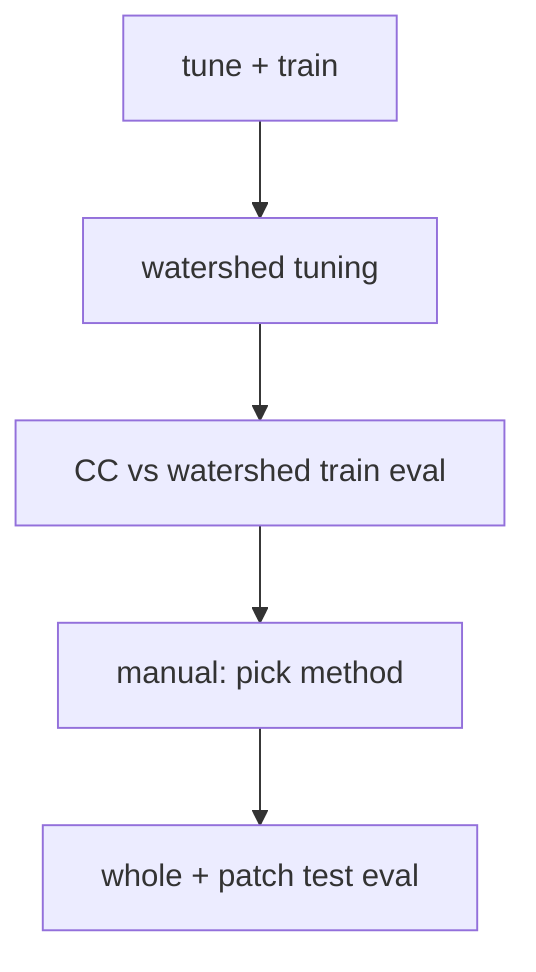

# U-Net runbook

Semantic segmentation + instance extraction (connected components or tuned watershed). Scratch layout: [`docs/reference/scratch-layout.md`](../reference/scratch-layout.md). Staging: [`docs/reference/staging.md`](../reference/staging.md). Manifests: [`docs/manifests.md`](../manifests.md).

## Prerequisites

- [Preprocessing](preprocessing.md) through rasterized labels and manifests:
  - `dataset/train/train_labels.tif`
  - `dataset/train/manifests/{variant}.whole.json`, `dataset/test/manifests/{variant}.whole.json`
  - `dataset/test/unet_from_yolo/{variant}/manifest.json` for patch test eval
- Pretrained start: `models/unet/pretrained/starting_point.keras` on scratch (or repo `models/pretrained/` fallback)

Jobs stage **manifest-listed files only** via `python -m common.stage_manifest run`.

## Pipeline overview



| Phase | Submit script | Run script |
|-------|---------------|------------|
| Tune + train | `submit_tune_and_train_variants.sh` | `run_tune_and_train_variant.sh` |
| Watershed predict | `submit_watershed_tuning.sh` | `run_watershed_tune_predict.sh` |
| Watershed tune | `submit_watershed_tuning.sh` | `run_watershed_tuning.sh` |
| Train instance compare | `submit_cc_vs_watershed_train_eval.sh` | `run_whole_test_eval.sh` ×2 |
| Test whole | `submit_whole_test_eval.sh` | `run_whole_test_eval.sh` |
| Test patches | `submit_patch_test_eval.sh` | `run_patch_test_eval.sh` |

Scripts under `SLURM/unet/`.

## Config files

| File | Role |
|------|------|
| `SLURM/unet/whole_eval_models.tsv` | Model basename + variant rows for whole eval |
| `config/variants.yaml` | Channel counts, default model basenames, watershed tune dir slugs |

## Tune and train variants

**Submit:** `sbatch SLURM/unet/submit_tune_and_train_variants.sh`

**Options:** `--ppl`, `--ppl-ppx-composite`, `--ppl-plus-ppx-composite`, `--all-ppx`, `--all`; `--resume`, `--skip-tuning`, `--verbose`

Bayesian search (optional) + final training per variant. Requires `train_labels.tif` and `dataset/train/manifests/{variant}.whole.json`.

| Output | Path |
|--------|------|
| Models | `models/unet/unet_finetuned_{variant}.keras` |
| Tuning logs | `tuning_logs/{run_name}/` |

```bash
sbatch SLURM/unet/submit_tune_and_train_variants.sh --all
```

## Watershed tuning

**Submit:** `bash SLURM/unet/submit_watershed_tuning.sh`

Required **two-phase** workflow per **input configuration** (registry variant):

1. **Predict** — `run_watershed_tune_predict.sh` runs sliding-window U-Net inference once on the train whole section and writes durable semantic predictions to scratch.
2. **Tune** — `run_watershed_tuning.sh` reads cached preds via `--preds-dir` only and scores the production default **72-candidate** watershed grid. The tune job never runs U-Net inference.

`submit_watershed_tuning.sh` submits predict then tune with `--dependency=afterok` per variant. A combined predict+tune single job is not the default path.

**Default grid axes** (grain-scale; omits pixel-scale `min_distance=1`): `min_distance=(3, 5, 9)`, `boundary_dilate_iter=(0, 1)`, `watershed_connectivity=(1, 2)`, `min_area_px=(0, 64, 256)`, `exclude_border=(0, 1)`, `ridge_level=(None)` — see `unet.watershed_tune_grid` and `run_watershed_tuning.sh` bash arrays.

Train-side watershed tuning still selects by **whole-section PQ** on the train **merged instance view** and persists **`MergedViewPqResult`** audit fields (`best_mean_pq` / `best_mean_*` / `best_per_sample_*` in `watershed_best_*.json`; `mean_*` / `{field}__{sample_id}` in the grid CSV). Selection uses **`pq` / `mean_pq` only**; other fields are diagnostics. Held-out **eval** still uses the full [**instance metric bundle**](../metrics.md#instance-metrics-all-producers) ([PQ policy](../metrics.md#pq-centered-rerun-policy)).

**Runtime (order of magnitude):** expect **many hours per registry variant** on the train whole section (~10k×52k merged view): roughly tens of minutes per grid combo before multiply by 72. The tune SLURM job requests **12 hours** wall time (`run_watershed_tuning.sh`). Do **not** run the full grid on a **login node** — use `bash SLURM/unet/submit_watershed_tuning.sh` or `srun`/`sbatch` for smoke checks (`unet.watershed_tune_smoke`) only.

| Output | Path |
|--------|------|
| Cached preds | `runs/watershed_tune_preds/{slugs.job}/semantic/{sample_id}_pred.tif` |
| Best params | `runs/watershed_tune/{slugs.job}/watershed_best_*.json` |

`--dry-run` prints `sbatch` commands without submitting.

```bash
bash SLURM/unet/submit_watershed_tuning.sh
```

### Pre-SLURM smoke check

Before submitting the full watershed tune grid, exercise one parameter combo on synthetic large-shape masks (no cached preds, manifests, or GPKG reads):

```bash
uv run python -m unet.watershed_tune_smoke
```

Defaults: train-section aspect ratio at 1/10 scale (`1000×5200`), one representative grid point, real watershed extraction plus `compute_merged_view_pq`. Logs include per-phase `watershed` and `metrics` timings like the tune job.

| Flag | Purpose |
|------|---------|
| `--full-shape` | Use train mosaic geometry `10000×52000` (slow; prefer `srun` on a compute node) |
| `--height` / `--width` | Override declared geometry |
| `--min-distance`, `--boundary-dilate-iter`, … | Override the single combo under test |

Focused tests: `uv run pytest src/unet/tests/test_watershed_tune_smoke.py -q`

## CC vs watershed (train section)

**Submit:** `sbatch SLURM/unet/submit_cc_vs_watershed_train_eval.sh`

Two jobs compare connected components vs tuned watershed on **train** using `whole_eval_models.tsv`, `--manifest-split train`, `train_labels.gpkg`.

| Output | Path |
|--------|------|
| CC | `eval/instance_val_cc/` |
| Watershed | `eval/instance_val_watershed/` |
| Selection | `eval/extraction_method_selection.json` |

`submit_cc_vs_watershed_train_eval.sh` submits both eval jobs and a follow-up selection job (`run_cc_vs_watershed_selection.sh`) that picks the method by mean train whole-section **PQ** across registry variants. Overlays remain supporting evidence for failure-mode review, not the selection criterion.

`eval/extraction_method_selection.json` records the PQ winner and per-variant [**`MergedViewPqResult`**](../metrics.md#tune-path-vs-eval-path-diagnostics) fields from train scoring. Use that file when choosing `--instance-method` for held-out whole test. Stale AJI-driven selection: [`metrics.md`](../metrics.md#stale-aji-selected-scratch-outputs).

## Whole test eval

**Submit:** `bash SLURM/unet/submit_whole_test_eval.sh`

Held-out **test** whole section. Default instance method: watershed (reads tune JSONs from `runs/watershed_tune/`).

| Output | Contents |
|--------|----------|
| `eval/unet_test/` | `prediction_sets/*.json`, `run_provenance.json`, semantic TIFFs |

Override via direct `run_whole_test_eval.sh` (`--instance-method cc|watershed`, `--config-file`, …).

## Patch test eval

**Submit:** `bash SLURM/unet/submit_patch_test_eval.sh`

One job per variant on `dataset/test/unet_from_yolo/{variant}/manifest.json`.

Pipeline: `unet.predict` → `semantic/`; `unet.extract_instances` → `prediction_sets/{sample_id}.json` + `run_provenance.json`; `stage_manifest write-eval`; `common.evaluate_instances`.

| Output | Path |
|--------|------|
| Per job | `eval/unet_patches/{variant}/{job_id}/` (`instance_metrics.json`, `prediction_sets/`, `semantic/`, `run_provenance.json`) |

## Example commands

```bash
sbatch SLURM/unet/submit_tune_and_train_variants.sh --all
bash SLURM/unet/submit_watershed_tuning.sh
sbatch SLURM/unet/submit_cc_vs_watershed_train_eval.sh
bash SLURM/unet/submit_whole_test_eval.sh
bash SLURM/unet/submit_patch_test_eval.sh
```

## Upstream / downstream

| Inputs | From |
|--------|------|
| `train_labels.tif`, whole manifests | [preprocessing](preprocessing.md) |
| `test_labels.gpkg`, `unet_from_yolo` manifests | Preprocessing + `write_patch_manifests.py --write-unet-manifests` |

| Outputs | Used for |
|---------|----------|
| `models/unet/unet_finetuned_*.keras` | Watershed tune, eval |
| `runs/watershed_tune/{slug}/` | Whole eval (`--instance-method watershed`) |
| `eval/unet_test/`, `eval/unet_patches/` | [analysis](analysis.md), thesis comparison with YOLO |
