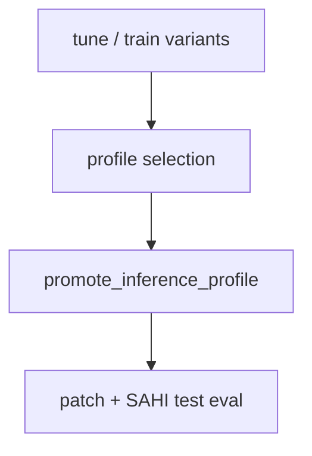

# YOLO runbook

YOLO26 instance segmentation: tune/train per **input configuration**, **profile selection** on the train whole section, then held-out test eval (patch + SAHI whole). Scratch layout: [`docs/reference/scratch-layout.md`](../reference/scratch-layout.md). Staging: [`docs/reference/staging.md`](../reference/staging.md).

## Prerequisites

- [Preprocessing](preprocessing.md) through patch datasets: `dataset/train/patches/{variant}/` with `manifest.json` and `{variant}.yaml`, and `dataset/test/patches/{variant}/`.
- YOLO uses **stacked** train/test mosaics from patch manifests—not per-channel TIFFs in U-Net whole manifests.
- Test eval needs `runs/yolo26-seg/{variant}/weights/best.pt` for all registry variants and `dataset/test/test_labels.gpkg`.

## Pipeline overview



| Phase | Submit script | Run scripts |
|-------|---------------|-------------|
| Tune / train | `submit_tune_or_train_variants.sh` | `run_tune_or_train_variant.sh` |
| Profile selection | `submit_inference_profile_tune.sh` | detector → GT cache → venv → candidates → finalize |
| Test eval | `submit_test_evaluations.sh` | `run_patch_test_eval.sh`, `run_sahi_test_eval.sh` |

Scripts under `SLURM/yolo/`.

## Tune and train variants

**Submit:** `bash SLURM/yolo/submit_tune_or_train_variants.sh`

**Run:** `run_tune_or_train_variant.sh` — stages patch manifests into `$TMPDIR`.

| Mode | Flags |
|------|-------|
| Tune | `--tune` (Ultralytics tuner: learning rate, dropout) |
| Train | `--all`, `--ppl`, `--ppl-ppx-composite`, `--ppl-plus-ppx-composite`, `--all-ppx`; `--resume`, `--verbose` |

- Pretrained weights: `pretrained/yolo26l-seg.pt` on scratch.
- **Output:** `runs/yolo26-seg/{variant}/weights/best.pt`

### Training memory

| Variant | `sbatch --mem` |
|---------|----------------|
| `PPL`, `PPLPPXblend` | 200G |
| `PPL+PPXblend` | 350G |
| `PPL+AllPPX` | 1000G |

### Examples

```bash
bash SLURM/yolo/submit_tune_or_train_variants.sh --all --tune
bash SLURM/yolo/submit_tune_or_train_variants.sh --all
```

## Profile selection

**Submit:** `bash SLURM/yolo/submit_inference_profile_tune.sh`

Runs on the **train** whole section after **all registry** variant weights exist and **score merge** at predict is in use. Submit sets `OUTPUT_DIR=runs/yolo_inference_profile_tune/<run_id>/`. Re-run when train labels or weights change materially—not after every single-variant job.

ADR: [0005](../adr/0005-yolo-inference-profile-train-selection.md). Glossary: **Profile selection** in [`CONTEXT.md`](../../CONTEXT.md).

### 1. Detector array

**Script:** `run_profile_tune_detector.sh` (array)

| Resource | Default |
|----------|---------|
| Memory | 32G GPU |
| Parallelism | 36 tasks, max **6** concurrent (`DETECTOR_MAX_PARALLEL`) |
| Time | 00:10:00 |

Writes **tiled detector proposals** (`schema_version` 2) under `_work/{variant}/tiled_proposals/c{conf}_t{mask}/`.

### 2. Ground-truth cache

**Script:** `run_profile_tune_gt_cache.sh`

| Resource | Default |
|----------|---------|
| Memory | 32G CPU |
| Time | 04:00:00 |
| Depends on | `afterok` detectors |

Rasterizes train GT to `_work/gt_cache/train/` (`src/common` only).

### 3. Venv prep

**Script:** `run_profile_tune_venv_prep.sh`

| Resource | Default |
|----------|---------|
| Memory | 32G CPU |
| Time | 00:30:00 |
| Depends on | `afterok` GT cache |

One `uv sync` to `$SCRATCH/.venvs/yolo-profile-tune/<lockfile-hash>/`.

### 4. Candidate array

**Script:** `run_profile_tune_candidate.sh` (one task per grid candidate)

| Resource | Default |
|----------|---------|
| Memory | 50G |
| CPUs | 1 |
| Time | 08:00:00 |
| Depends on | `afterok` venv prep |

Copies shared venv to `$TMPDIR/.venv`, `uv run --no-sync`. Writes `grid/rows/{candidate_id}.json`.

### 5. Finalize

**Script:** `run_profile_tune_finalize.sh`

| Resource | Default |
|----------|---------|
| Memory | 32G |
| Time | 01:00:00 |
| Depends on | `afterok` candidate array |

Writes `grid/results.csv` and `grid/winner.json`.

### Promotion

```bash
uv run --directory src/yolo python -m yolo.promote_inference_profile \
  --winner-json "$SCRATCH/GrainSeg/runs/yolo_inference_profile_tune/<run_id>/grid/winner.json"
```

Commit `configs/test_inference.yaml` after promotion.

### Rerun without detectors

`--skip-detectors` (or `SKIP_DETECTORS=1`) skips the detector array when this `OUTPUT_DIR` already has valid v2 tiled proposals under `_work/`. Submit still runs GT cache, venv prep, the candidate array, and finalize. Use when detectors already finished in the same run directory—not to reuse caches from an incompatible older run (see ADRs 0006/0007).

### Finalize recovery

If finalize did not run but `grid/rows/*.json` or `results.csv` exist:

```bash
uv run --directory src/yolo python -m yolo.profile_tune_finalize \
  --output-dir "$SCRATCH/GrainSeg/runs/yolo_inference_profile_tune/<run_id>"
```

## Test evaluations

**Submit:** `bash SLURM/yolo/submit_test_evaluations.sh`

Per registry variant, submits patch eval and whole SAHI eval. Requires promoted **test inference recipe** and all `best.pt` weights.

| Job | Script | Output root |
|-----|--------|-------------|
| Patch | `run_patch_test_eval.sh` | `eval/yolo_patches/{variant}/{job_id}/` |
| Whole SAHI | `run_sahi_test_eval.sh` | `eval/yolo_{variant}/` (override `OUTPUT_ROOT` / `SAHI_OUT`) |

### Test job resources

Peak RSS ~12–15G on current test mosaic for SAHI whole; **score merge** decodes one proposal mask at a time.

| Job | `sbatch --mem` | `sbatch --time` |
|-----|----------------|-----------------|
| SAHI whole (all variants) | 32G | 00:20:00 |
| Patch test | 32G | 00:08:00 |

Command-line `sbatch --mem` / `--time` override `#SBATCH` in run scripts.

### Examples

```bash
bash SLURM/yolo/submit_inference_profile_tune.sh
bash SLURM/yolo/submit_test_evaluations.sh

export VARIANT='PPL+AllPPX'
sbatch --export=ALL,VARIANT SLURM/yolo/run_patch_test_eval.sh
sbatch --export=ALL,VARIANT SLURM/yolo/run_sahi_test_eval.sh
```

### Artifacts

- **`prediction_sets/{sample_id}.json`:** canonical **instance prediction set** (non-overlapping grains after **score merge**, each with **score**).
- **`run_provenance.json`:** `score_merge_at_predict: true`, resolved **YOLO inference profile** (`conf`, `mask_threshold`; whole adds SAHI merge and slice geometry).
- Optional AP/mAP diagnostics come from Ultralytics patch val, not whole-section eval.
- Eval uses `stage_manifest write-eval` → `eval_manifest.json`; no second merge at eval.

Pre-change eval trees on scratch are invalid—delete `eval/yolo_{variant}/` and `eval/yolo_patches/{variant}/*/` and re-run test eval before refreshing reporting.

## Upstream / downstream

| Inputs | From |
|--------|------|
| Patch datasets, `data.yaml` | [preprocessing](preprocessing.md) |
| `test_labels.gpkg` | Preprocessing |

| Outputs | Used for |
|---------|----------|
| `runs/yolo26-seg/{variant}/weights/best.pt` | Profile selection, test eval |
| `runs/yolo_inference_profile_tune/<run_id>/` | Audit trail |
| `configs/test_inference.yaml` | Shared test recipe |
| `eval/yolo_patches/`, `eval/yolo_{variant}/` | Metrics, [analysis](analysis.md) |

U-Net patch test crops (`dataset/test/unet_from_yolo/`) share YOLO patch geometry but are consumed by [unet.md](unet.md).
