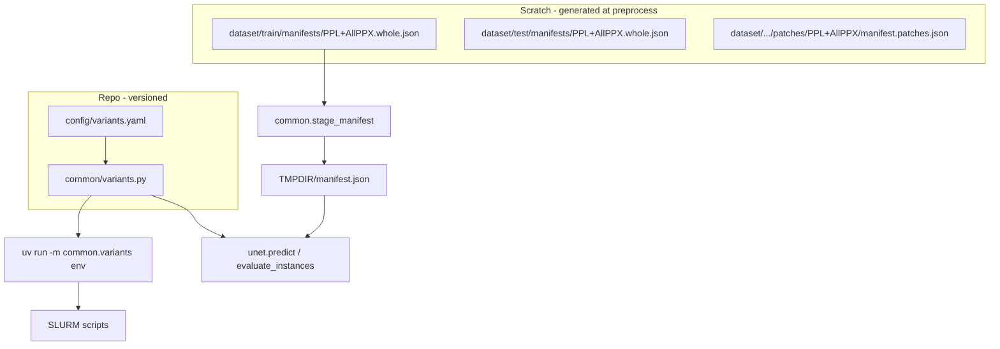

## One-off refactor plan: variant registry + manifests

Goal: one canonical definition of microscopy variants, explicit sample inventories per dataset unit, and SLURM/Python pipelines that never infer samples by scanning `dataset/train/` or stripping filename suffixes.

This is a **breaking refactor** (aligned with `AGENTS.md`): remove discovery paths once manifests exist, update all callers in one pass.

---

### Current pain (scope drivers)

| Problem | Example |
|--------|---------|
| Duplicate variant metadata | `variants.sh`, `yolo/config.py`, hardcoded suffixes in tune/eval scripts |
| Directory scan treats every TIFF as a sample | `cc_val` fails on `train_PPL+AllPPX.tif` while predict uses `train` from `train_PPL.tif` |
| `unit=whole` still uses patch discovery | `run_whole_test_eval.sh` → `collect_patch_samples` |
| TMPDIR staging re-implements path logic | Copy dirs + hope glob still works |
| Stem inference for artifacts | `infer_model_config`, watershed subdir slugs |

---

### Target architecture



**Two layers (do not merge):**

1. **Registry** — what each variant *means* (inputs, channels, default paths, naming slugs).
2. **Manifest** — which files constitute each *sample* for a given split/unit.

---

### Phase 0 — Design & schemas (no runtime change)

#### 0.1 Variant registry file

Add `config/variants.yaml` (versioned, reviewed like code):

```yaml
schema_version: 1
variants:
  PPL+AllPPX:
    unet:
      num_inputs: 7
      input_suffixes: [_PPL, _PPX1, _PPX2, _PPX3, _PPX4, _PPX5, _PPX6]
      channels_per_input: 3
    yolo:
      input_channels: 21
      dataset_subdir: "PPL+AllPPX"
      yaml_name: "PPL+AllPPX.yaml"
    paths:
      train_mosaic_stacked: "dataset/train/train_{variant}.tif"  # or explicit per variant
      test_mosaic_stacked: "dataset/test/test_{variant}.tif"
    slugs:
      job: "PPL_AllPPX"           # watershed tune dir, SLURM-safe
      model_file: "unet_finetuned_PPL+AllPPX.keras"
```

Include all four variants from README; document every slug that today differs (`PPL_AllPPX` vs `PPL+AllPPX`, `PPL_PPXblend.yaml` vs dir name).

Avoid a generic `channels` field because current call sites mix several meanings. Use explicit names:

- `unet.num_inputs`
- `unet.channels_per_input`
- `yolo.input_channels` (3/3/6/21 for the stacked YOLO TIFFs)

#### 0.2 Manifest schema

Extend `common/manifest_io.py` contract (document in `docs/manifests.md`):

```json
{
  "schema_version": 1,
  "variant": "PPL+AllPPX",
  "unit": "whole",
  "grainseg_root": "/scratch/.../GrainSeg",
  "path_base": "grainseg_root",
  "samples": [
    {
      "sample_id": "train",
      "images": [
        "dataset/train/train_PPL.tif",
        "dataset/train/train_PPX1.tif"
      ],
      "mask": "dataset/train/train_labels.tif",
      "gt_gpkg": "dataset/train/train_labels.gpkg",
      "gt_origin": "whole_image"
    }
  ]
}
```

Rules:

- Paths are relative to `grainseg_root` for scratch manifests (`path_base: "grainseg_root"`). Staging rewrites this root and emits a new manifest rooted at `$WORK_ROOT`.
- Rows may use `image` **or** `images`, but not both:
  - `image`: single stacked TIFF row, used by YOLO and single-image whole-eval consumers.
  - `images`: U-Net multi-input row; list length must match variant `unet.num_inputs` (validated at load).
- Optional fields: `pred_instances`, `semantic`, `gt_txt` (YOLO patches).
- **Do not** put stacked YOLO mosaics in U-Net whole manifests.

#### 0.3 Dataset units (enumerated)

| Unit ID | Manifest location (proposed) | Used by |
|--------|------------------------------|---------|
| `train.whole.{variant}` | `dataset/train/manifests/{variant}.whole.json` | U-Net train-section eval, watershed tune |
| `test.whole.{variant}` | `dataset/test/manifests/{variant}.whole.json` | Whole-image test eval |
| `train.patches.{variant}` | `dataset/train/patches/{variant}/manifest.json` | U-Net/YOLO patch train (optional v1) |
| `test.patches.{variant}` | `dataset/test/patches/{variant}/manifest.json` | Patch test eval |

v1 can ship **whole + test patches** first; patch train can keep YOLO yaml discovery until phase 4.

#### 0.4 Acceptance criteria (global)

- [x] No production path uses `infer_microscopy_variant_from_model_stem` or `collect_patch_samples` for whole-section eval.
- [x] `cc_val`-style job succeeds for all four variants without scanning stacked TIFFs (manifest + `whole_eval_models.tsv`; verify on cluster via `submit_cc_vs_watershed_train_eval.sh`).
- [x] Single edit to `variants.yaml` updates YOLO + U-Net + SLURM path hints.
- [x] Tests cover registry load, manifest validation, staging rewrite (`test_stage_manifest_integration_file_count` copies 7 channel TIFFs for `PPL+AllPPX`).

---

### Phase 1 — Registry in Python

#### 1.1 `src/common/variants.py`

- Load YAML → frozen dataclasses (`VariantSpec`, `UnetSpec`, `YoloSpec`, `PathTemplates`).
- `get_variant(name)`, `all_variant_names()`, `validate()`.
- Resolve paths with `grainseg_root: Path`.
- **Replace** `src/yolo/config.py` `VARIANT_CONFIGS` with thin re-exports from common (or delete and import `get_variant` everywhere).

#### 1.2 CLI for bash

`python -m common.variants` subcommands:

- `env --variant PPL+AllPPX` → shell-exportable `NUM_INPUTS`, `IMAGE_SUFFIXES`, paths (replaces `variants.sh` case blocks).
- `print-json --variant ...` for debugging.

Add `[project.scripts]` or document `uv run` invocation in README.

#### 1.3 Tests

- Registry parses all four variants.
- Channel counts match README (3/6/21).
- Slugs stable vs existing watershed dirs (or document one-time rename migration on scratch).

#### 1.4 Deprecate `SLURM/utils/variants.sh`

- Phase 1 end: `variants.sh` becomes a 3-line wrapper that sources `eval "$(uv run ... variants env ...)"` **or** delete and update all `source variants.sh` call sites.

**Do not** keep duplicate case statements.

---

### Phase 2 — Manifest I/O + staging

#### 2.1 `common/manifest_io.py` upgrades

- `load_dataset_manifest(path) -> DatasetManifest` (typed).
- Validate against registry (`variant`, `image` vs `images`, `len(images)`, required keys per `unit`).
- `collect_manifest_samples` already exists — align it with `DatasetManifest` while preserving single-image `image` rows for YOLO/evaluation.
- `collect_manifest_unet_samples()` for predict/train (wraps image list → current `list_samples` dict shape).

#### 2.2 `common/stage_manifest.py`

- Input: canonical manifest + optional file subset.
- Copy listed files to `$WORK_ROOT`, emit `$WORK_ROOT/manifest.json` with updated paths (absolute or relative to work root).
- Used by all SLURM jobs that today `cp -r` directories.

#### 2.3 Whole-section manifest generation

Add `data_prep/write_whole_manifests.py` (or extend preprocessing):

- Reads registry + scans **only** files referenced by variant templates.
- Writes one `dataset/train/manifests/{variant}.whole.json` per variant with one sample (`sample_id: train`) and only per-channel paths for U-Net multi-input variants.
- Writes `dataset/test/manifests/{variant}.whole.json` similarly (`sample_id: test`).

Wire into preprocessing after step 6 (`create_multichannel_input_tiffs.sh`) — stacked TIFFs exist but are **excluded** from U-Net manifests.

#### 2.4 Hotfix path (can land before full phase 3)

Update `run_whole_test_eval.sh` to write/use eval manifest after predict (same pattern as `run_sahi_test_eval.sh`). Use the final manifest schema shape, not a throwaway compatibility format. Unblocks `cc_val` immediately.

---

### Phase 3 — Python pipelines consume manifests

#### 3.1 `unet.predict`

- Add `--manifest` (mutually exclusive with discovery mode).
- Load samples from manifest; drop default reliance on `list_samples` when manifest set.
- Keep `--image-dir` + suffixes as **dev-only** behind `--discover-samples` flag, then remove.

#### 3.2 `unet.train` / `train_unet_multi_input.py` / `tune_watershed`

- Accept `--manifest` for train mosaic sample(s).
- Tune script copies via `stage_manifest` instead of suffix loop.

#### 3.3 `common.evaluate_instances`

- For `unit=whole`: require `--manifest` **or** `--image` + `--pred-instances` (no directory scan).
- Add `collect_whole_samples_from_manifest` path; never iterate all TIFFs in train dir.
- Patch mode: prefer `--manifest`; directory scan optional deprecation.

#### 3.4 YOLO

- `resolve_variant_paths` already uses registry (phase 1).
- `predict` / `evaluate_mask_ap` / `export_sahi_visualization`: manifest already supported — align schema with new `DatasetManifest`.
- Patch eval: add manifest from `dataset/test/patches/{variant}/manifest.json`.

#### 3.5 `unet.extract_instances`

- Optional `--manifest` to drive sample list from semantic outputs (today `*_pred.tif` glob is OK if sample_ids match manifest; validate ids match manifest in eval stage).

---

### Phase 4 — Preprocessing emits patch manifests

#### 4.1 `create_patch_datasets.sh` / `split_tiff_gpkg_to_yolo.py`

After patchify, write `manifest.json` per variant:

- Each patch: `sample_id`, `image` for YOLO stacked/single TIFF rows, or `images` for U-Net multi-input rows under `unet_from_yolo/...`.
- `gt_txt` or link to gpkg + `gt_origin: patch_stem`.

#### 4.2 `crop_unet_masks_from_yolo_patches.py`

- Read YOLO patch manifest; write U-Net patch manifest with raster mask paths.

#### 4.3 Consolidate `write_yolo_dataset_yamls` in shell

- Generate yaml `channels` from registry, not duplicated heredocs in `create_patch_datasets.sh`.

---

### Phase 5 — SLURM thin wrappers

Update in order (each job: stage manifest → pass `--manifest` + `--variant`):

| Script | Changes |
|--------|---------|
| `run_whole_test_eval.sh` | Stage `{variant}.whole.json`; eval via manifest; overlay uses manifest sample_id |
| `run_patch_test_eval.sh` | Stage patch manifest; drop `image-stem-suffix` |
| `run_tune_and_train_variant.sh` | `variants env`; stage train manifest row for variant |
| `run_watershed_tuning.sh` | Registry paths + manifest |
| `yolo/run_*` | `variants env`; patch/whole manifests |
| `submit_*` | Unchanged loops over `all_variant_names()` from CLI |
| `watershed.sh` | Resolve tune subdir via registry `slugs.job`, not stem inference |

Remove:

- `infer_model_config`, `infer_microscopy_variant_from_model_stem` (or restrict to legacy model dir migration tool only).
- `find_default_ppl_image` / `infer_overlay_sample_id` — take anchor image from manifest.

**Model-dir auto-discovery** in whole eval: replace with explicit config TSV **or** manifest per model under `eval/config.json` listing `model_path`, `variant`, `manifest`.

---

### Phase 6 — Docs, validation, cleanup

- README: “Dataset contracts” section pointing to registry + manifests.
- `SLURM/preprocessing/pipeline.md`: new step “write manifests”.
- One integration test: load train whole manifest for `PPL+AllPPX`, stage to tmp, verify 7 images copied.
- Re-run `submit_cc_vs_watershed_train_eval.sh` on cluster as smoke test.

Delete dead code:

- `common/samples.list_samples` (or keep only for data_prep internal use until patch manifests exist).
- Redundant inline Python heredocs in SLURM for manifest creation — use `common.write_manifest` helper.

---

### Suggested execution order (one PR series or single long branch)

```
Phase 0 (design doc + schemas)
    ↓
Phase 1 (registry) ──────────────────────────┐
    ↓                                          │
Phase 2.2–2.3 (manifest I/O + whole manifests)  │
    ↓                                          │
Phase 2.4 / whole eval hotfix (cc_val fix)     │  parallelizable
    ↓                                          │
Phase 4 (patch manifests + preprocessing)      │
    ↓
Phase 3 (Python predict/eval/train)  ←─────────┘
    ↓
Phase 5 (SLURM)
    ↓
Phase 6 (docs + delete legacy)
```

---

### Scratch / migration notes

- **Existing scratch trees**: run `write_whole_manifests.py` once against current `dataset/train` without re-preprocessing.
- **Watershed tune dirs**: if registry slug matches existing `PPL_AllPPX` folders, no move; if renaming, document one-time `mv` on scratch.
- **Breaking**: jobs that passed raw `--image-dir` without variant manifest will fail until updated — intentional.

---

### Risks & mitigations

| Risk | Mitigation |
|------|------------|
| Manifest drift after manual file copies | `validate_manifest` CLI; CI test loads all committed example manifests |
| Large patch manifests (10k+ rows) | JSON is fine; optional `.jsonl` later; stage only eval subset if needed |
| bash without uv on login node | `prepare_env.sh` already syncs; registry CLI runs after `uv sync` |
| Path-base ambiguity | Require `path_base: "grainseg_root"` in scratch manifests; staging rewrites to work root |

---

### Out of scope (explicitly)

- Migrating `plot_tuning_charts.py` run discovery (keep glob on `runs/`).
- Changing on-disk TIFF naming (`train_PPL+AllPPX.tif` stays for YOLO).
- Versioned manifest history / MLflow — plain files under `dataset/` are enough.

---

### Definition of done

1. [x] `config/variants.yaml` is the only variant definition.
2. [x] Every eval/train job for U-Net whole section uses a manifest.
3. [x] `cc_val` / `watershed_val` wired for all four variants (cluster smoke test documented in README).
4. [x] `variants.sh` is a thin wrapper over `common.variants` CLI.
5. [x] README documents how to regenerate manifests and stage to `$TMPDIR`.